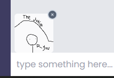
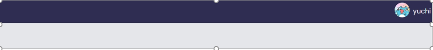
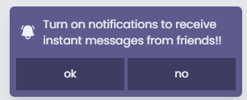

# Chat

## React + TypeScript + Tailwind CSS + Firebase

This project does not utilize any UI framework


## env

you need to create a file named `.env.local` and write Firestore parameters in it.

```ini
VITE_apiKey=
VITE_authDomain=
VITE_projectId=
VITE_storageBucket=
VITE_messagingSenderId=
VITE_appId=
```

## 已完成

### 避免頁面閃爍

頁面會在新頁面完成加載以後才卸載舊頁面，避免 Suspense 因為時間過短造成閃爍

### 部分元件已完成骨架屏(Skeleton)


### 附加程式碼片段到聊天訊息

聊天訊息可以附加程式碼片段，目前支援的程式語言有 `Java`, `Python`, `JavaScript`, `TypeScript`.


### 直接粘貼圖片到訊息輸入框

例如你可以使用 windows 的剪取工具(Snipping Tool)先截圖與複製  


然後直接粘貼到輸入框，就會附加圖片上去  


### 上傳使用者頭像

  
  
  


### 聊天訊息即時通知




### 多國語言

依照瀏覽器語言選擇繁體中文或英文(預設)

## Todo

- 透過無限滾動(infinite scrolling)取得舊的聊天記錄，避免初次載入過多聊天訊息
- 完成其他元件的骨架屏
